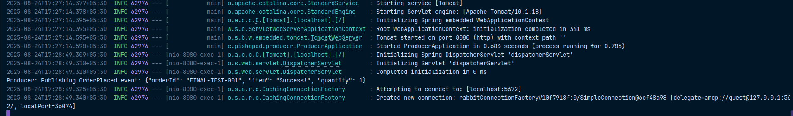
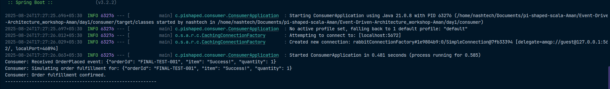

# Event-Driven Architecture with Java and RabbitMQ - by Aman

This project provides a practical implementation of an Event-Driven Architecture (EDA) using a simple e-commerce order processing system. It demonstrates how a **Producer** service can publish an `OrderPlaced` event, how a **RabbitMQ** message broker can reliably route this event, and how a **Consumer** service can process it asynchronously.

This example showcases key EDA principles like loose coupling, asynchronous communication, and improved resilience, built with a modern Java stack.

## Technology Stack

*   **Java 21**: The latest Long-Term Support version of Java.
*   **Spring Boot 3.2.2**: Framework for building robust, stand-alone Java applications.
*   **RabbitMQ**: An open-source message broker used for asynchronous communication.
*   **Maven**: Build automation and dependency management tool.
*   **Docker**: For running the RabbitMQ instance in a containerized environment.

---

## Core Concept Questions

### 1. What is an event in Event-Driven Architecture?

In an event-driven system, an **event** is an immutable record of a significant business occurrence. Think of it as a factual statement that "something happened." It doesn't contain any instructions on what to do; it simply announces a change of state.

**Real-world Example (outside of technology):**
Imagine borrowing a book from a library. When the librarian scans your book, an event, let's call it `BookCheckedOut`, occurs. This single event triggers multiple independent processes without the librarian needing to manage them directly:
*   The **Library Catalog System** reacts by marking the book as unavailable.
*   The **User Account System** reacts by adding the book to your borrowed list and setting a due date.
*   The **Notification System** might react by scheduling a "due date reminder" email.
*   An **Analytics System** could react by incrementing a counter for that book's popularity.

The `BookCheckedOut` event is the central fact, and each system reacts to it independently, demonstrating the power of a decoupled, event-driven approach.

### 2. Compare Event-Driven Architecture (EDA) with Request-Response Architecture.

| Aspect | Request-Response Architecture | Event-Driven Architecture (EDA) |
| :--- | :--- | :--- |
| **Interaction** | **Synchronous & Blocking:** A client makes a request and is blocked, waiting for the server to process it and return a direct response. | **Asynchronous & Non-Blocking:** A producer sends an event and immediately moves on, without waiting for a response from the consumers. |
| **Coupling** | **Tightly Coupled:** The client (requester) must know the specific location (endpoint) and interface of the server (responder). | **Loosely Coupled:** The producer and consumer do not know about each other. They only communicate indirectly through the message broker. |
| **Scalability** | **Challenging:** Scaling often requires scaling the entire request-response chain together. A slow responder can create a bottleneck for the requester. | **Highly Scalable:** Producers and consumers can be scaled independently. If event processing is slow, you can simply add more consumer instances. |
| **Resilience** | **Brittle:** If the responding service is down, the client's request fails immediately. This can lead to cascading failures across the system. | **Highly Resilient:** If a consumer is down, the message broker acts as a buffer, holding events until the consumer recovers and can process them. The producer is unaffected. |
| **Advantages** | Simple, predictable, and easy to implement for direct interactions where an immediate answer is required. | Excellent for complex, distributed systems requiring high scalability, resilience, and flexibility. |
| **Disadvantages**| Can lead to performance bottlenecks and a tightly coupled "monolith" of services. | More complex to debug and monitor due to its asynchronous nature. Requires careful management of eventual consistency. |

### 3. How would you use EDA to manage an E-commerce order workflow?

Using EDA in e-commerce allows for a highly robust and extensible order management process:

*   **Placing an Order:** When a user submits an order, the **Order Service** validates it, saves it to a database with a `PENDING` status, and then immediately publishes a detailed `OrderPlaced` event. The service then quickly returns a success message to the user, ensuring a responsive user experience.
*   **Sending a Confirmation Email:** A separate **Notification Service** subscribes to `OrderPlaced` events. Upon receiving one, it is responsible for formatting and sending a confirmation email to the customer. This decouples the email logic; if the email provider has a temporary issue, it doesn't prevent the order from being processed.
*   **Updating Inventory:** The **Inventory Service** also subscribes to `OrderPlaced` events. When it receives an event, it decrements the stock for the purchased items. If an item is out of stock, it can publish its own event, like `InventoryUpdateFailed`, which the Order Service could listen for to handle the problem (e.g., by cancelling the order).

### 4. Why is EDA a great fit for Microservices and Cloud-Native systems?

EDA is a natural architectural pattern for microservices for two powerful reasons:

1.  **Enforces Service Autonomy and Loose Coupling:** The primary goal of microservices is to have small, independent teams build, deploy, and scale their services autonomously. EDA is the perfect communication model for this. Services don't make direct, blocking calls to each other. Instead, they communicate through a central broker by producing and consuming events. This means the `Order Service` team can make changes and deploy updates without needing to coordinate with the `Inventory` or `Notification` teams, as long as the "contract" (the structure of the `OrderPlaced` event) is maintained.
2.  **Promotes Resilience and Fault Tolerance:** Cloud-native systems are designed with the expectation that failures will happen. EDA builds resilience directly into the architecture. The message broker acts as a shock absorber. If the `Inventory Service` crashes, the `Order Service` and other parts of the application can continue to function perfectly, and orders will continue to be accepted. The `OrderPlaced` events will simply queue up in RabbitMQ, waiting for the `Inventory Service` to restart and process them, preventing data loss.

### 5. How does EDA help build scalable systems? (With Use Cases)

EDA enables scalability by allowing every part of a workflow to be scaled independently based on its specific needs. You can scale the number of consumers processing a particular event without impacting the producers or any other part of the system.

**Real-world Use Cases:**

1.  **Food Delivery App (e.g., DoorDash, Zomato):**
    *   **The Challenge:** When an order is placed, multiple things need to happen in parallel: the restaurant must be notified, a delivery driver must be found, the customer needs real-time tracking, and payment must be processed. A traditional request-response system would be slow and brittle.
    *   **The EDA Solution:** A single `OrderPlaced` event is published. This event is consumed independently by:
        *   A `Restaurant Service` that sends the order to the restaurant's terminal.
        *   A `Dispatch Service` that starts searching for nearby drivers.
        *   A `Payment Service` that processes the transaction.
        *   A `Tracking Service` that creates a tracking session for the customer.
            Each of these services can be scaled independently. If there's a surge in orders, you can add more instances of the Dispatch Service without affecting the restaurant notifications.

2.  **Financial Trading Platforms:**
    *   **The Challenge:** A trading platform needs to process millions of market data changes (events) per second, execute trades with extremely low latency, perform real-time risk analysis, and log everything for compliance.
    *   **The EDA Solution:** Every price change in the market is an event. These `MarketDataUpdated` events are broadcast through a high-speed message broker.
        *   `Trading Algorithm Services` consume these events to make buy/sell decisions.
        *   A `Risk Management Service` consumes them to continuously calculate portfolio risk.
        *   A `User Dashboard Service` consumes them to update real-time charts for users.
            This parallel, event-driven processing is the only way to achieve the high throughput and low latency required in financial markets.

---

## How to Run This Project

### Prerequisites

*   Java 21 JDK
*   Apache Maven
*   Docker Desktop

### Steps to Run

1.  **Start RabbitMQ using Docker:**
    Make sure Docker is running. In the project's root directory (`day1/`), run the following command to start the RabbitMQ container.
    ```bash
    docker-compose up -d
    ```
    You can check the RabbitMQ Management UI at `http://localhost:15672` (user: `guest`, pass: `guest`).

2.  **Build the Entire Project:**
    In the project's root directory (`day1/`), run the following Maven command. This will build both the producer and consumer modules.
    ```bash
    mvn clean install
    ```

3.  **Run the Producer Application:**
    In a new terminal, navigate to the `producer` directory and run:
    ```bash
    mvn spring-boot:run
    ```

4.  **Run the Consumer Application:**
    In another new terminal, navigate to the `consumer` directory and run:
    ```bash
    mvn spring-boot:run
    ```

5.  **Place an Order to Trigger an Event:**
    In a third terminal, use `curl` to send a POST request to the producer's API:
    ```bash
    curl -X POST -H "Content-Type: application/json" -d '{"orderId": "ORD-12345", "item": "Event-Driven Architecture Book", "quantity": 1}' http://localhost:8080/api/orders
    ```

---

## Verification: Expected Output

After sending the `curl` command, you will see immediate output in your Producer and Consumer terminals, confirming the end-to-end event flow.

### Producer Terminal Output

The producer log will show that it has received the API request and published the event.


```
```
### Consumer Terminal Output

The consumer log will show that it has received the event from RabbitMQ and processed it. This is the proof that the system is working.


```